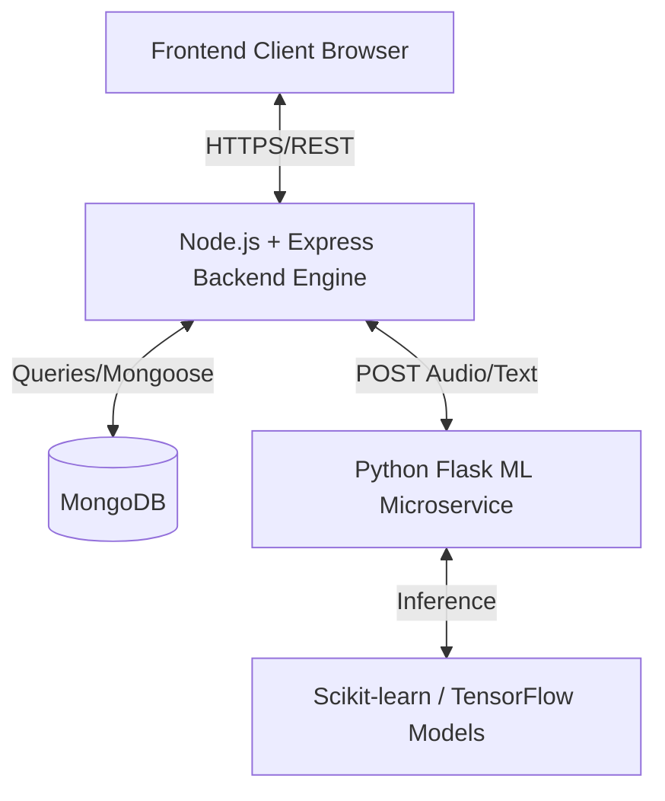

# System Architecture

The AI-Based Schizophrenia Detection System uses a modern 3-tier architecture:

1. **Presentation Layer (Frontend)**: Standard HTML, CSS, JavaScript using Bootstrap for responsiveness. Interacts with the backend via RESTful APIs.
2. **Application Layer (Backend)**: Built with Node.js and Express. It manages business logic, user authentication (JWT), and API orchestration.
3. **Machine Learning Layer (Microservice)**: Built with Python and Flask. This service is dedicated to running Scikit-learn models for inference on text and speech inputs.
4. **Data Layer (Database)**: MongoDB is used to retain user profiles and prediction history securely.

