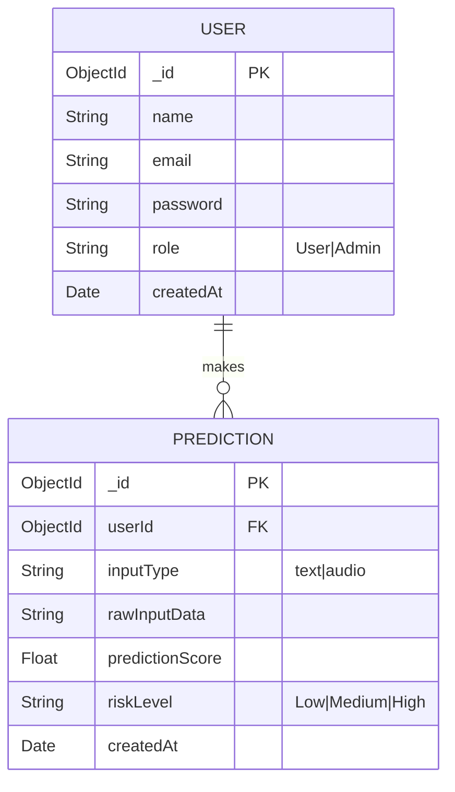

# Entity Relationship (ER) Diagram

```mermaid
erDiagram
    USER {
        ObjectId _id PK
        String name
        String email
        String password
        String role "User|Admin"
        Date createdAt
    }
    PREDICTION {
        ObjectId _id PK
        ObjectId userId FK
        String inputType "text|audio"
        String rawInputData
        Float predictionScore
        String riskLevel "Low|Medium|High"
        Date createdAt
    }
    
    USER ||--o{ PREDICTION : "makes"
```
