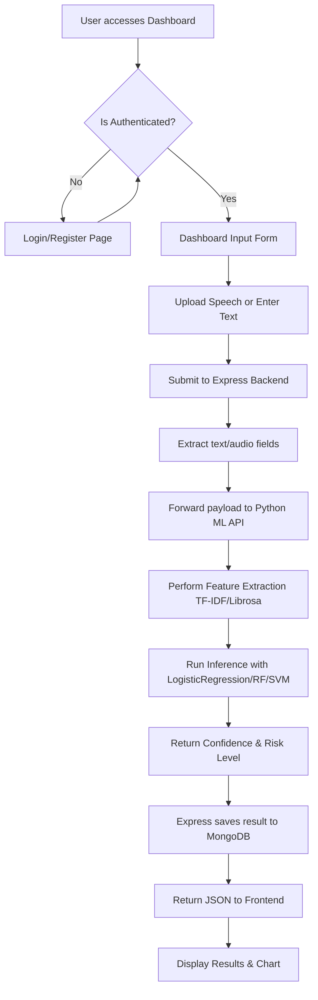

# Process Flowchart

This flowchart demonstrates the full life cycle of a user request to the prediction system.

```mermaid
flowchart TD
    A[User accesses Dashboard] --> B{Is Authenticated?}
    B -- No --> C[Login/Register Page]
    C --> B
    B -- Yes --> D[Dashboard Input Form]
    D --> E[Upload Speech or Enter Text]
    E --> F[Submit to Express Backend]
    F --> G[Extract text/audio fields]
    G --> H[Forward payload to Python ML API]
    H --> I[Perform Feature Extraction TF-IDF/Librosa]
    I --> J[Run Inference with LogisticRegression/RF/SVM]
    J --> K[Return Confidence & Risk Level]
    K --> L[Express saves result to MongoDB]
    L --> M[Return JSON to Frontend]
    M --> N[Display Results & Chart]
```
